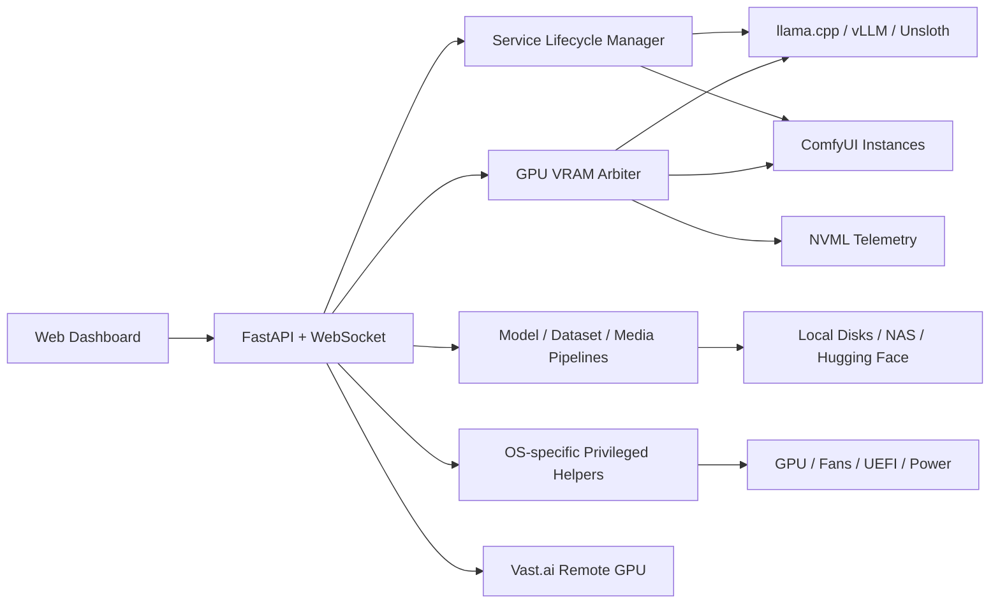

# AI Workstation Orchestrator

**개인 GPU 워크스테이션을 하나의 AI 인프라 플랫폼으로 바꾸는 크로스플랫폼 운영 콘솔**입니다. `llama.cpp`, ComfyUI, vLLM을 포함한 10여 개 AI 워크로드의 배포·실행·관찰·자원 조정을 단일 FastAPI 애플리케이션으로 통합했습니다.

단순한 프로세스 실행기를 넘어, GPU별 VRAM admission/eviction, 하드웨어 텔레메트리, 모델·데이터셋 파이프라인, OpenAI 호환 API 벤치마크, NAS와 원격 GPU 인스턴스까지 연결하는 **self-hosted AI operations control plane**을 지향합니다. Linux와 Windows의 서로 다른 서비스·권한·하드웨어 제어 방식을 하나의 웹 UX로 추상화했습니다.

### Project highlights

- **Cross-platform orchestration** — Ubuntu systemd와 Windows supervisor/UAC helper를 같은 관리 경험으로 통합
- **GPU-aware scheduling** — NVML 실측과 GPU별 상태 머신을 이용해 ComfyUI·llama.cpp 간 VRAM 경합을 자동 조정
- **End-to-end AI workflow** — 모델 확보부터 추론 서버 실행, 데이터셋 구축, 미디어 처리, 성능 검증까지 한 제품 안에서 수행
- **Long-context benchmarking** — 최대 컨텍스트 자동 탐지와 1K~252K 단계별 TTFT/prefill/decode 측정 지원
- **Operational safety** — GPU UUID 기반 설정, 권한 제한 helper, 확인 헤더, 프로세스 세대 관리와 종료 검증 적용

> 이 프로젝트는 시스템 전원, GPU 설정, 프로세스와 파일을 제어할 수 있습니다. 기본 서버는 인증 없이 `0.0.0.0:8999`에 바인딩되므로 인터넷에 직접 노출하지 말고 신뢰할 수 있는 로컬 네트워크, 방화벽 또는 별도의 인증 프록시 뒤에서만 사용하세요.

## 주요 기능

- **서비스 관리**: llama.cpp, ComfyUI 2개 인스턴스, vLLM, Unsloth, DeepSeek Harness 및 사용자 에이전트 서비스 실행·중지·로그 확인
- **GPU 운영**: NVIDIA GPU/VRAM/온도/프로세스 모니터링, 전력·코어 클럭 설정, HBM 과열 이벤트 기록
- **VRAM Arbiter**: ComfyUI와 llama.cpp 요청을 GPU별로 조정하고, VRAM이 부족할 때 유휴 상주 모델을 정리
- **모델 허브**: Hugging Face/Civitai 모델 다운로드, 설치 모델 검색, 파일 업로드·이동·삭제
- **인프라 관리**: ComfyUI·vLLM 환경 설치, NAS 연결, Git/GitHub 설정, Linux GUI/CLI 모드 및 재부팅 대상 관리
- **미디어 도구**: URL 미디어 다운로드, ffmpeg 기반 변환, 선택형 AI 음성 분리
- **Audio / Video Text**: Qwen3-ASR·ForcedAligner·Whisper 기반 자막, Omni 오디오 캡션과 멀티모달 타임라인
- **데이터셋 도구**: 이미지 수집·검수·복구·내보내기와 Instagram/X 쿠키 연동
- **LLM 벤치마크**: OpenAI 호환 API의 TTFT, prefill 및 decode 처리량 측정
- **Serving Stats**: 실행 중인 vLLM/llama.cpp/ComfyUI의 실시간 처리량·지연·캐시 지표 대시보드
- **Vast Remote**: Vast.ai Jupyter 인스턴스에서 llama.cpp/ComfyUI 실행과 로컬 터널 관리
- **웹 터미널**: 브라우저에서 서버별 터미널 세션 관리

## 검증된 운영 스냅샷

저장소에 포함된 최신 측정 데이터는 OpenAI 호환 vLLM 엔드포인트에서 모델의 **262,144 토큰 최대 컨텍스트를 자동 탐지**하고, 1K~64K 단계 테스트와 150K 장문 테스트를 완료한 결과입니다.

| 시나리오 | 측정 결과 |
| --- | ---: |
| 1K~64K 상세 벤치마크 최고 prefill | **3,457.5 tok/s** |
| 1K 구간 decode | **141.5 tok/s** |
| 150K 실제 프롬프트 처리 | **149,995 tokens** |
| 150K prefill / decode | **3,227.3 / 126.8 tok/s** |

VRAM Arbiter는 고정 추정치에만 의존하지 않고 실제 peak를 학습합니다. 현재 스냅샷에는 두 ComfyUI 인스턴스의 관측 peak 약 **31.1 GB / 18.2 GB**와 다중 GPU 구성이 저장되어 이후 admission 판단에 재사용됩니다. 수치는 해당 장비·모델·설정에서 얻은 실측값이며 다른 환경의 성능을 보장하지 않습니다.

## 아키텍처



| 계층 | 기술 및 설계 |
| --- | --- |
| Backend | Python, FastAPI, Uvicorn, asyncio, REST, WebSocket |
| Frontend | 의존성 없는 HTML/CSS/JavaScript 대시보드, 실시간 로그·터미널 |
| GPU | NVML, `nvidia-smi`, GPU UUID 기반 영속 설정, VRAM 상태 머신 |
| Runtime | llama.cpp, vLLM, ComfyUI, Hugging Face Hub, OpenAI-compatible API |
| System | systemd user service, Windows supervisor, C# 관리자 helper, sudo allowlist |
| Storage/Remote | NAS/CIFS, 로컬 모델 저장소, Vast.ai Jupyter 터널 |

### 핵심 엔지니어링

- **GPU별 독립 동시성 제어**: 전역 잠금 대신 GPU 도메인별 lock/queue와 `UNLOADED → RESIDENT → ACTIVE` 상태 전이를 사용해 서로 다른 카드의 작업이 불필요하게 막히지 않습니다.
- **실측 기반 VRAM 계획**: NVML을 최종 기준으로 삼고, 첫 작업의 peak를 학습해 다음 요청부터 공존 가능성을 최적화합니다. 미관리 CUDA 프로세스의 사용량도 판단에 포함합니다.
- **안전한 프로세스 수명 주기**: PID 파일만 신뢰하지 않고 명령행과 프로세스 생존 여부를 검증하며, 시작/중지 generation으로 중복 실행과 늦게 도착한 종료 요청을 방지합니다.
- **최소 권한 하드웨어 제어**: 웹 서버 자체를 관리자 권한으로 실행하지 않고, Linux sudo allowlist와 Windows 토큰 인증 helper에 위험 작업을 격리합니다.
- **장애 복구 중심 운영**: 저장된 GPU 설정 재적용, 서비스 자동 재시작, fan lease 만료 시 펌웨어 제어 복귀, 실행 중 작업 상태 복원 등 재부팅·비정상 종료를 고려했습니다.
- **재현 가능한 성능 측정**: prefix cache miss를 유도하는 유니크 프롬프트, 서버 토크나이저 보정, 스트리밍 TTFT와 decode 분리 측정으로 엔진 간 비교 가능한 결과를 저장합니다.

## 빠른 시작

### Linux (Ubuntu)

필수 조건은 NVIDIA 드라이버가 설치된 Ubuntu, Python 3, `sudo` 권한입니다. 설치 스크립트는 패키지 설치뿐 아니라 systemd 사용자 서비스, SSH, 모델 볼륨/NAS 준비, GPU 제어 helper와 부팅 모드까지 구성합니다. 실행 전에 [`setup_env.sh`](setup_env.sh)의 변경 범위를 확인하세요.

```bash
git clone https://github.com/Flun/ai-workstation-orchestrator.git
cd ai-workstation-orchestrator
./setup_env.sh
```

설치가 끝나면 서비스가 자동으로 시작됩니다.

```bash
./open_manager.sh
```

상태와 로그는 다음 명령으로 확인할 수 있습니다.

```bash
systemctl --user status main_server.service
journalctl --user -u main_server.service -f
```

시스템 통합 항목과 설치 위치는 [`system/README.md`](system/README.md)를 참고하세요.

### Windows

Python과 Microsoft App Installer(`winget`)가 필요합니다. 초기 설정은 Git/GitHub CLI와 Python 의존성을 설치하고, 관리자 권한이 필요한 팬·GPU·UEFI 작업용 helper를 빌드합니다.

```bat
git clone https://github.com/Flun/ai-workstation-orchestrator.git
cd ai-workstation-orchestrator
setup_env.bat
start_manager.bat
```

브라우저만 열거나 서버가 꺼져 있을 때 함께 시작하려면 `open_manager.bat`을 사용합니다. 로그인 시 자동 시작은 다음 명령으로 등록합니다.

```bat
install_autostart.bat
```

Windows 기능별 차이와 하드웨어 제약은 [`WINDOWS_PORT.md`](WINDOWS_PORT.md)에 정리되어 있습니다.

### 최소 개발 실행

OS 통합이나 하드웨어 제어 없이 웹 애플리케이션만 확인하려면 가상 환경을 직접 만들 수 있습니다. 일부 화면은 외부 실행 파일이나 관리자 helper가 없으면 제한됩니다.

```bash
python3 -m venv .venv
. .venv/bin/activate
pip install -r requirements.txt
python app.py
```

실행 후 [http://127.0.0.1:8999](http://127.0.0.1:8999)에 접속합니다.

## 화면 구성

| 경로 | 용도 |
| --- | --- |
| `/` | 서비스 상태, 하드웨어, 로그, 터미널과 전원 제어 |
| `/model-hub` | 모델 다운로드와 파일 관리 |
| `/media` | 미디어 다운로드·변환·AI 처리 |
| `/av-text` | 로컬 GPU 음성 인식·오디오 캡션·영상 분석 |
| `/dataset` | 이미지 데이터셋 수집과 검수 |
| `/infrastructure` | 런타임 설치, NAS, Git 및 시스템 설정 |
| `/llm-bench` | LLM API 성능 측정과 결과 비교 |
| `/bench-suite` | 외부 벤치(llm-evaluation-harness 정확도 · llm-inference-bench 동시성 매트릭스) — 카드·실행 기록 보관 |
| `/vast` | Vast.ai 원격 인스턴스 관리(로컬 접속만 허용) |

기본 서비스 포트는 다음과 같습니다.

| 서비스 | 포트 |
| --- | ---: |
| AI Workstation Orchestrator | `8999` |
| llama.cpp | `8080` |
| ComfyUI main / GPU 1 | `8188` / `8189` |
| vLLM | `8000` |
| Unsloth Studio | `8890` |

## 설정

플랫폼별 설정 파일은 처음 저장할 때 프로젝트 루트에 생성됩니다.

- Linux: `linux_settings.json`
- Windows: `windows_settings.json`
- 예제: [`linux_settings.example.json`](linux_settings.example.json), [`windows_settings.example.json`](windows_settings.example.json)

설정 우선순위는 **플랫폼 설정 JSON → 환경 변수 → `config.py` 기본값**입니다. 주요 환경 변수는 다음과 같습니다.

| 환경 변수 | 설명 |
| --- | --- |
| `COMFY_DIR`, `COMFY_PYTHON`, `COMFY_MODEL_ROOT` | ComfyUI 설치, Python, 모델 경로 |
| `LLAMA_INSTALL_ROOT`, `LLAMA_VERSION_GLOB`, `LLAMA_PORT` | llama.cpp 설치 루트, 버전 검색 패턴, 포트 |
| `MODEL_ROOT` | 공용 모델 저장소 |
| `VLLM_ENV`, `VLLM_DFLASH_ENV`, `VLLM_PORT` | vLLM 안정/실험 환경과 포트 |
| `UNSLOTH_EXECUTABLE`, `UNSLOTH_PORT` | Unsloth 실행 파일과 포트 |
| `BOT_DIR`, `WATCHER_DIR` | 외부 bot/watcher 프로젝트 경로 |
| `AUTOSTART`, `AUTOSTART_LLAMA`, `AUTOSTART_COMFYUI`, `AUTOSTART_VLLM` | manager 및 주요 서비스 자동 시작 |

런타임 설정, 자격 증명, 로그, 데이터셋 결과는 `.gitignore`로 제외됩니다. API 키나 NAS/서비스 자격 증명을 저장소에 커밋하지 마세요.

## 선택 기능

AI 음성 분리가 필요하면 별도 의존성을 설치합니다.

```bash
./setup_media_ai.sh
```

Windows에서는 `setup_media_ai.bat`을 사용합니다. ffmpeg/ffprobe가 없으면 미디어 변환 기능이 제한됩니다.

로컬 GPU Audio/Video → Text 모델은 메인 환경과 분리해 설치합니다. 자세한 구조와 API는 [`MEDIA_ANALYSIS.md`](MEDIA_ANALYSIS.md)를 참고하세요.

```bash
./setup_media_analysis.sh
```

CMP 170HX와 vLLM의 전용 구성은 [`VLLM_CMP170HX.md`](VLLM_CMP170HX.md), VRAM Arbiter의 운영 원리는 [`ARBITER_GPU_DOMAIN.md`](ARBITER_GPU_DOMAIN.md)를 참고하세요.

## 테스트

`pytest`는 런타임 의존성에 포함되지 않으므로 개발 환경에 별도로 설치합니다.

```bash
python3 -m pip install pytest
python3 -m pytest -q
python3 -m unittest test_motherboard_fan -v
```

일부 테스트와 하드웨어 기능은 NVIDIA GPU, 해당 드라이버 또는 OS별 helper가 있어야 정상 동작합니다.

## 프로젝트 구조

```text
app.py                 FastAPI 애플리케이션과 메인 대시보드 API
config.py              플랫폼별 기본값과 환경 변수 설정
process_mgr.py         외부 서비스 프로세스 수명 주기 관리
gpu.py                 NVIDIA GPU 상태와 VRAM 프로세스 탐색
vram_arbiter.py        GPU별 VRAM admission/eviction 조정
model_hub.py           모델 다운로드와 파일 관리 API
media.py               미디어 다운로드·변환 API
media_analysis.py      Audio/Video 분석 작업·캐시·서비스 제어 API
media_analysis_service.py  격리된 모델 inference 서비스
dataset_api.py         데이터셋 작업 API
infrastructure.py      설치, NAS, vLLM 및 시스템 통합 API
llm_bench.py           OpenAI 호환 LLM 벤치마크
bench_suite.py         외부 벤치 도구(lm-eval/llm-inference-bench) 실행·결과 파싱
system/                Linux 서비스와 권한 제한 helper 원본
fan_helper/            Windows 관리자 권한 하드웨어 helper
```

## 운영 시 주의사항

- 이 대시보드에는 프로세스 강제 종료, 파일 조작, 시스템 재시작·종료 API가 포함됩니다.
- GPU 튜닝 값은 카드 UUID 기준으로 저장되지만, 새 하드웨어에서는 낮은 전력/클럭 값부터 검증하세요.
- Linux 설치 스크립트의 기본 모델 볼륨 UUID와 경로는 실제 장비에 맞게 조정해야 합니다.
- Windows의 팬/PawnIO 및 CMP 170HX 기능은 UAC 승인과 호환 하드웨어가 필요합니다.
- 설정을 바꾼 뒤에는 대시보드 상태와 `logs/` 또는 systemd 로그를 함께 확인하세요.
